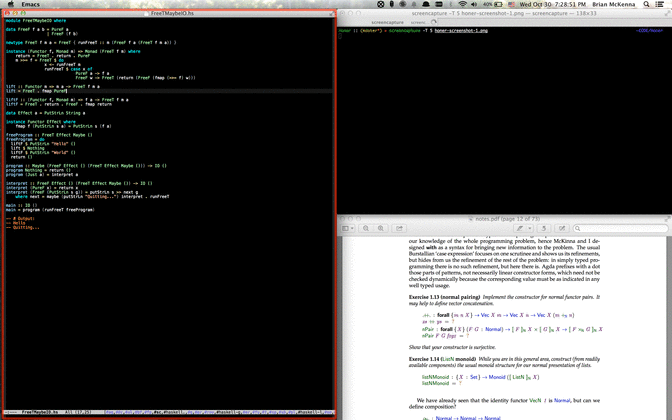
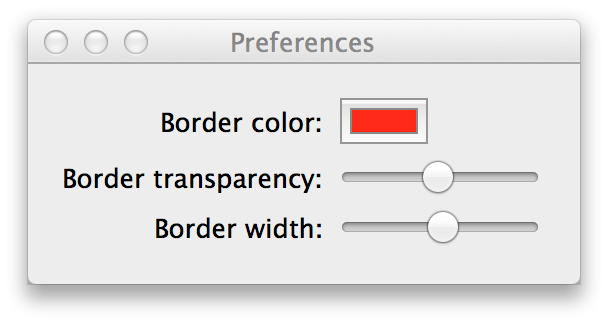

# Honer

## About

Honer is an OS X application to draw a border around the focused
window. It's useful for people who use tiling window managers and
people who have accessibility requirements.

Honer requires at least OS X 10.9 (Mavericks).

## Download

You can download the
[latest release here](https://github.com/puffnfresh/Honer.app/releases/download/v1.0/Honer-6e3863f2.zip).

## Screenshots

## License

MIT
